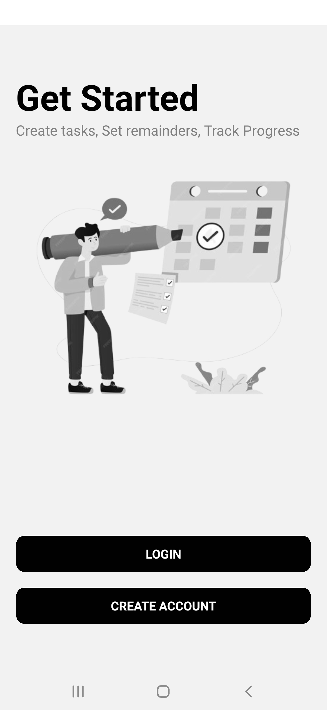
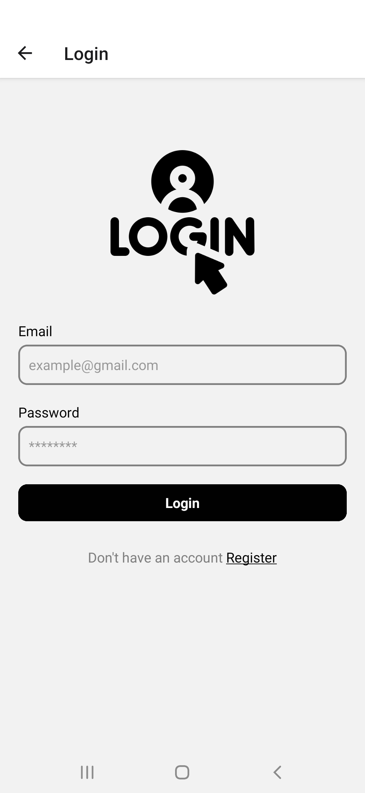
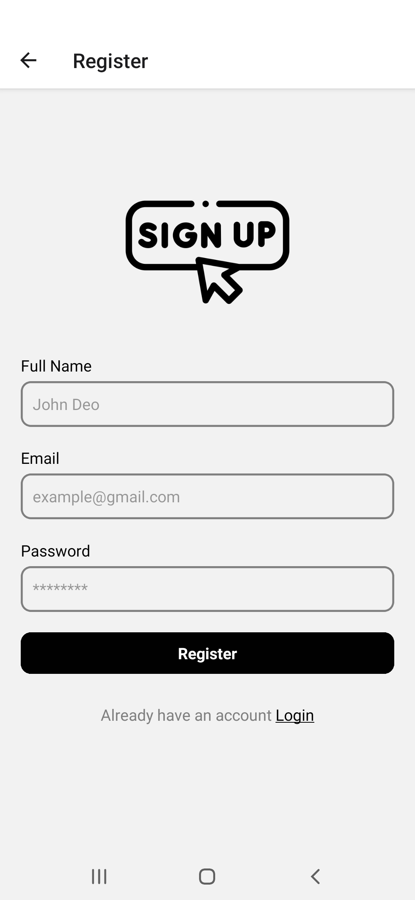
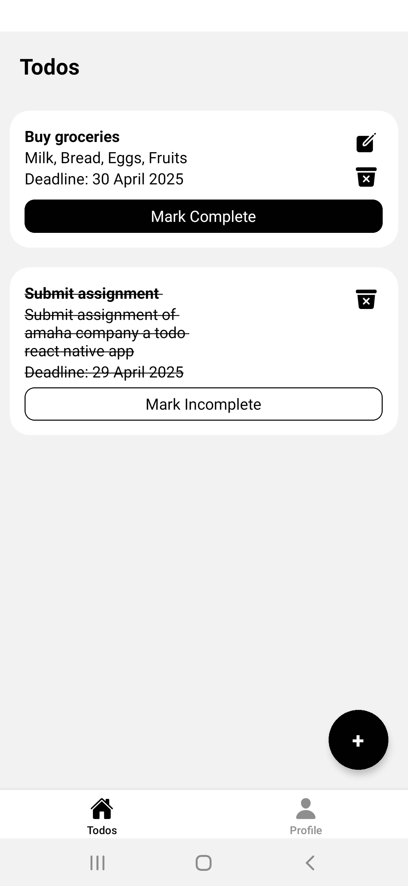
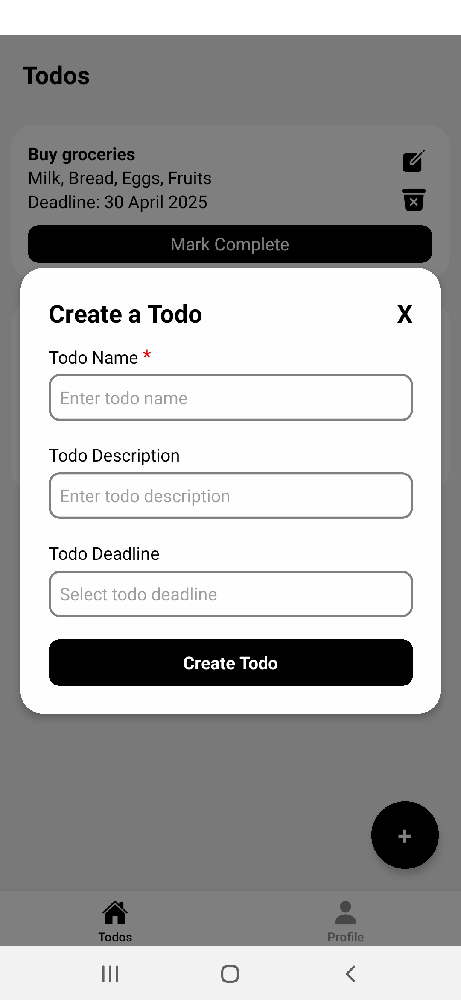
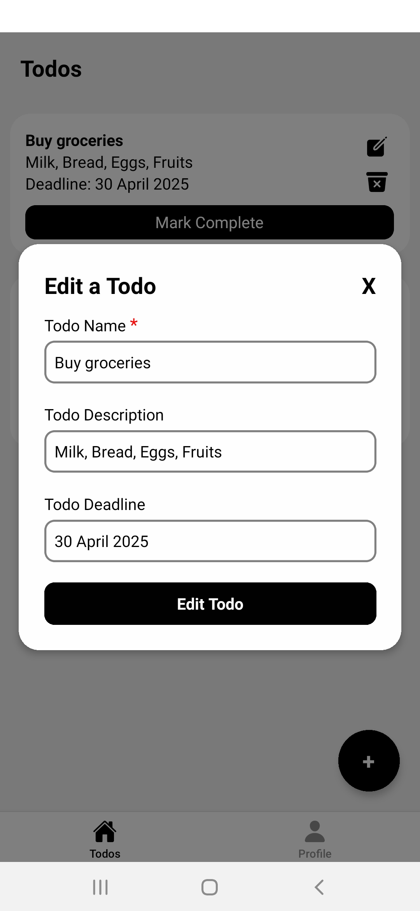
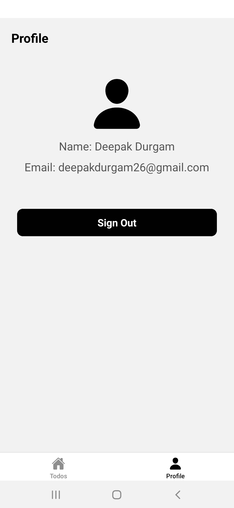

### To-Do List App

A simple yet powerful React Native To-Do List app built with Expo, integrated with Firebase Authentication and Firestore Database

## Features

- **Authentication:** Users can sign up and sign in using Firebase Authentication.
- **CRUD:** Users can create, read, update, and delete tasks.
- mark complete/incomplete tasks

## APK

- [Link](https://drive.google.com/file/d/14qZHJli0RgsJGxUvCHfYrYEzRvy8LTrn/view?usp=sharing)

## Screenshots

Home Screen

Login Screen

Register Screen

Todo Screen

Create Todo Screen

Edit Todo Screen

profile Screen

